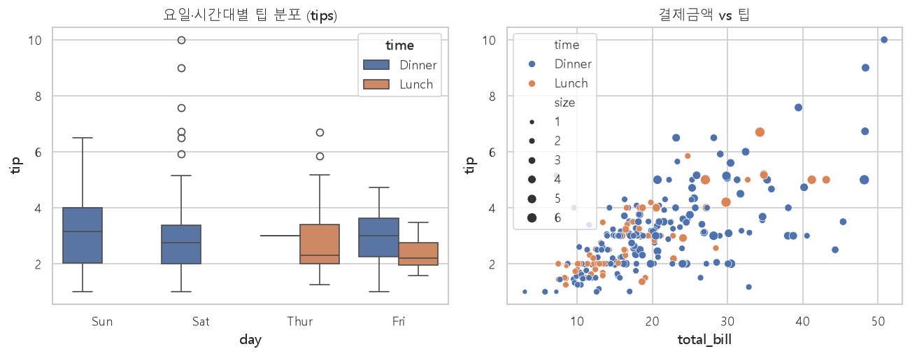
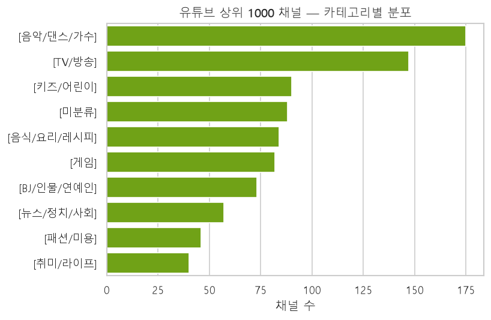

# 파이썬 & 데이터 분석 기초 / Python & Data Analysis Foundations

> **English summary** — This repository documents the Python fundamentals and the
> pandas / NumPy / visualization data-analysis workflow built during **Cohort 1 of the
> NVIDIA AI Academy Seoul (서울 엔비디아 아카데미)**. It moves from core language syntax,
> functions, classes, file I/O, regular expressions, and a small BeautifulSoup web-crawling
> pipeline, into hands-on data wrangling with real Korean open datasets — Seoul subway
> ridership, a Geumcheon-gu gas-station price feed, YouTube channel rankings, the classic
> `tips` / `Fish` datasets, and more. Every example was written by hand as part of the
> daily coursework, then organized here into a single, reproducible learning record.


---

## 개요

파이썬 언어 기초부터 데이터 분석의 첫 단계까지를 다루는 저장소입니다.
포트폴리오 학습 여정에서 **가장 밑단(foundation)** 에 해당하며, 이후의
`machine-learning-sklearn`, `deep-learning-keras` 등 상위 저장소가 이 위에서 동작합니다.

크게 두 축으로 구성됩니다.

- **01_python_basics** — 문법·자료형·조건/반복문·함수·모듈·클래스(OOP)·파일 입출력·정규표현식,
 그리고 `requests` + `BeautifulSoup` 기반 **네이버 뉴스 크롤링** 파이프라인.
- **02_data_analysis** — `numpy` 수치 연산 → `pandas` 데이터 가공(그룹핑/피벗/병합/재형성/전처리)
 → `matplotlib` / `seaborn` 시각화로 이어지는 데이터 분석 워크플로우.

모든 스크립트는 날짜 폴더(`20260518`~`20260602`)로 정리되어 학습 순서를 그대로 보존합니다.
샘플 데이터셋(csv/xlsx/xls)은 해당 스크립트 옆에 함께 두어 바로 실행할 수 있습니다.

---

## 구성 / Structure

### `src/01_python_basics/`

| 소주제 | 내용 | 대표 파일 |
| --- | --- | --- |
| 문법 · 자료형 | print/input, 문자열 메서드, 리스트·튜플·사전(dict) | [datatype_exam2.py](src/01_python_basics/20260518/datatype_exam2.py) · [사전_예제1.py](src/01_python_basics/20260519/사전_예제1.py) |
| 조건 · 반복문 | if/조건표현식, for/while 반복, `in`·`get()` | [조건표현식_예제.py](src/01_python_basics/20260520/조건표현식_예제.py) · [반복문_문제.py](src/01_python_basics/20260520/반복문_문제.py) |
| 함수 · 모듈 | 함수 정의/활용, 사용자 모듈 import, `__name__` | [함수_예제1.py](src/01_python_basics/20260520/함수_예제1.py) · [smartphone_main.py](src/01_python_basics/20260519/모듈_테스트/smartphone_main.py) |
| 클래스 (OOP) | `class`, `__init__` 생성자, 멤버변수/메서드, `self` | [클래스설계_예제.py](src/01_python_basics/20260526/클래스설계_예제.py) |
| 파일 입출력 | `open()`/`close()`, r/w/a 모드, `os`·`shutil` 디렉토리 조작 | [파일_입출력_예제1.py](src/01_python_basics/20260521/파일_입출력_예제1.py) · [파일_디렉토리_조작하기.py](src/01_python_basics/20260522/파일_디렉토리_조작하기.py) |
| 정규표현식 | `re.findall`/`search`/`sub`, 문자 클래스·메타문자·`\w` | [정규표현식_예제1.py](src/01_python_basics/20260522/정규표현식_예제1.py) |
| 웹 크롤링 | `requests` + `BeautifulSoup(lxml)` → DataFrame → 엑셀 저장 | [2.네이버뉴스_크롤링.py](src/01_python_basics/20260522/2.네이버뉴스_크롤링.py) |

### `src/02_data_analysis/`

| 소주제 | 내용 | 대표 파일 |
| --- | --- | --- |
| NumPy | 배열 산술·내적 연산, `concatenate`(축 기준 병합) | [numpy_산술연산.py](src/02_data_analysis/20260526/numpy_산술연산.py) · [numpy_내적연산.py](src/02_data_analysis/20260526/numpy_내적연산.py) |
| pandas — I/O | csv/xlsx/xls 읽기·쓰기, `set_option` 출력 옵션 제어 | [pandas_csv파일.py](src/02_data_analysis/20260527/pandas_csv파일.py) · [pandas_엑셀파일.py](src/02_data_analysis/20260527/pandas_엑셀파일.py) |
| pandas — 함수적용 | `apply`/`map`/`lambda`, `astype` 타입변환, `sort_values` | [tipsdata_함수적용.py](src/02_data_analysis/20260528/tipsdata_함수적용.py) · [pandas_엑셀_리드_예제1.py](src/02_data_analysis/20260528/pandas_엑셀_리드_예제1.py) |
| pandas — 그룹핑 | `groupby`(split-apply-combine), `pivot_table`, `margins` | [pandas_groupby_예제1.py](src/02_data_analysis/20260601/pandas_groupby_예제1.py) · [salesfunnel_pivot_table.py](src/02_data_analysis/20260601/salesfunnel_pivot_table.py) |
| pandas — 병합/재형성 | `merge`(left_on/right_on/how), `concat`, `pivot` 재형성 | [pandas_merge_예제.py](src/02_data_analysis/20260601/pandas_merge_예제.py) · [pandas_재형성_예제1.py](src/02_data_analysis/20260601/pandas_재형성_예제1.py) |
| pandas — 전처리 | 컬럼 삭제/`rename`, 결측치·시계열(`to_datetime`) 변환, 인덱스 설정 | [fishdata_전처리.py](src/02_data_analysis/20260601/fishdata_전처리.py) · [gas_info_처리.py](src/02_data_analysis/20260601/gas_info_처리.py) |
| 시각화 — matplotlib | 선/막대 그래프, `savefig`, 한글 폰트 설정 | [matplotlib_막대그래프_예제1.py](src/02_data_analysis/20260602/matplotlib_막대그래프_예제1.py) · [matplotlib_hangul_font_setting.py](src/02_data_analysis/matplotlib_hangul_font_setting.py) |
| 시각화 — seaborn | `barplot`/`lineplot`/`lmplot`, `hue`·palette 통계 시각화 | [seaborn_tips_그래프.py](src/02_data_analysis/20260602/seaborn_tips_그래프.py) · [seaborn_막대그래프_실습.py](src/02_data_analysis/20260602/seaborn_막대그래프_실습.py) |

---

## 다룬 데이터셋

| 데이터셋 | 설명 |
| --- | --- |
| `tips.csv` | 식당 팁 데이터 — groupby·pivot·seaborn 통계 시각화 실습의 표준 예제 |
| `Fish.csv` | 어종별 무게·길이·높이·너비 — 컬럼 정리, 피벗 평균, `lmplot` 회귀 산점도 |
| `youtube_rank_1000.xlsx` / `youtube_data.xlsx` | 유튜브 채널 랭킹 — 문자열 정제(`re.sub`)·타입변환·Top 10 막대차트 |
| `서울특별시_지하철 승하차 승객수.csv` | 서울 지하철 역별 승하차 승객수 (한글 컬럼, CP949 인코딩) |
| `seoul_keumchun_gas_info.csv` | 서울 금천구 주유소 가격 정보 — 시계열 변환·인덱스 설정 실습 |
| `population_in_seoul.xls` | 서울시 인구 통계 (구형 `.xls`, xlrd 로 읽기) |
| `salesfunnel.xlsx` | 영업 파이프라인 — 다중 인덱스 `pivot_table` + `margins` 집계 |
| `반도체_제어_이력.xlsx` / `국소마취제_groupby.xlsx` | 반도체 제어 이력·의약품 사용실적 — groupby/pivot 응용 |
| `Health_info.csv`, `scoredata.csv`, `redata.csv` | 파일 입출력·전처리 보조 샘플 데이터 |

> 원본 대용량 데이터는 `.gitignore` 로 제외하고, 실행 가능한 **소용량 샘플만** 저장소에 포함했습니다.

---

## 핵심 학습 내용

- **파이썬 언어 코어** — 자료형/시퀀스(list·tuple·dict), 조건표현식과 반복문,
 함수 설계, 사용자 모듈 분리와 `if __name__ == '__main__'` 관용구.
- **객체지향(OOP)** — `class`·`__init__` 생성자·멤버변수/메서드·`self` 바인딩과
 지역/멤버 변수 스코프 구분.
- **파일 & 시스템** — 텍스트 파일 입출력(r/w/a), `os`·`shutil` 을 이용한 디렉토리 조작.
- **정규표현식** — 문자 클래스(`[a-zA-Z0-9가-힣]`)·메타문자(`+`, `*`, `\w`)로 검색·분할·치환,
 실데이터 정제(`re.sub`)에 직접 활용.
- **웹 크롤링 파이프라인** — `requests`(User-Agent 헤더 포함) → `BeautifulSoup(lxml)` 파싱
 → `pandas.DataFrame` → `to_excel` 저장까지의 end-to-end 흐름.
- **NumPy** — 벡터/행렬 산술·내적 연산, `concatenate` 축 기준 결합.
- **pandas 데이터 가공** — `groupby`(split-apply-combine), `pivot_table`(다중 인덱스·`aggfunc`·`margins`),
 `merge`/`concat` 병합, `pivot` 재형성, `apply`/`map`/`lambda` 함수적용, `astype` 타입변환,
 결측치·시계열(`to_datetime`) 전처리.
- **시각화** — matplotlib 선/막대 그래프와 한글 폰트(malgun/AppleGothic) 설정,
 seaborn `barplot`·`lineplot`·`lmplot` 로 `hue`·palette 기반 통계 시각화.

---

## 데이터 시각화 (실제 출력)

저장소의 실습 데이터로 재현한 시각화입니다. (`results/`)

**seaborn 통계 시각화 — `tips` 데이터**


요일·시간대별 팁 분포(박스플롯)와 결제금액–팁 상관관계(산점도, 인원수=버블 크기)를 한 번에 표현했습니다.

**pandas + seaborn 집계 — 유튜브 상위 1000 채널**


`youtube_rank_1000.xlsx`를 `value_counts`로 집계해 카테고리별 채널 분포를 막대그래프로 시각화했습니다.

> 위 그림은 `results/` 생성 코드(pandas + seaborn)의 실제 출력입니다.

---

## 실행 방법

```bash
# 1) 의존성 설치
pip install -r requirements.txt

# 2) 예시 실행 — seaborn 으로 tips 데이터 막대차트 (스크립트 폴더에서 실행)
cd src/02_data_analysis/20260602
python seaborn_tips_그래프.py

# 3) 예시 실행 — 네이버 뉴스 크롤링 → 엑셀 저장
cd src/01_python_basics/20260522
python 2.네이버뉴스_크롤링.py
```

> 스크립트는 데이터 파일을 **상대 경로**로 참조하므로 해당 스크립트가 위치한 폴더에서 실행하세요.
> 한글 시각화가 깨질 경우 [matplotlib_hangul_font_setting.py](src/02_data_analysis/matplotlib_hangul_font_setting.py)
> 의 폰트 설정 블록을 참고하면 됩니다.

---

## 배운 점

- 언어 문법을 개별로 외우기보다, **모듈·클래스·파일 I/O 를 엮어 하나의 프로그램으로** 굴려보며
 구조적으로 코드를 나누는 감각을 익혔다.
- 데이터 분석의 8할은 시각화 이전의 **정제·타입변환·결측치/시계열 처리**임을 실데이터로 체감했다.
- `groupby` / `pivot_table` / `merge` 세 가지가 사실상 표 데이터 가공의 뼈대이며,
 같은 결과도 여러 방식(`apply` vs `map`, `merge` vs `concat`)으로 표현 가능함을 비교하며 배웠다.
- 한글 인코딩(CP949)·폰트 설정처럼, 국내 공공데이터를 다룰 때 실제로 부딪히는 잔손질을 경험했다.

---

## 참고

같은 조직(`NvidiaSeoul`)의 후속 저장소로 이어집니다.

- [machine-learning-sklearn](https://github.com/NvidiaSeoul/machine-learning-sklearn) — scikit-learn 기반 머신러닝
- [deep-learning-keras](https://github.com/NvidiaSeoul/deep-learning-keras) — Keras 기반 딥러닝

---

> NVIDIA AI Academy Seoul · Cohort 1 포트폴리오의 일부 — [전체 보기](https://github.com/NvidiaSeoul)
